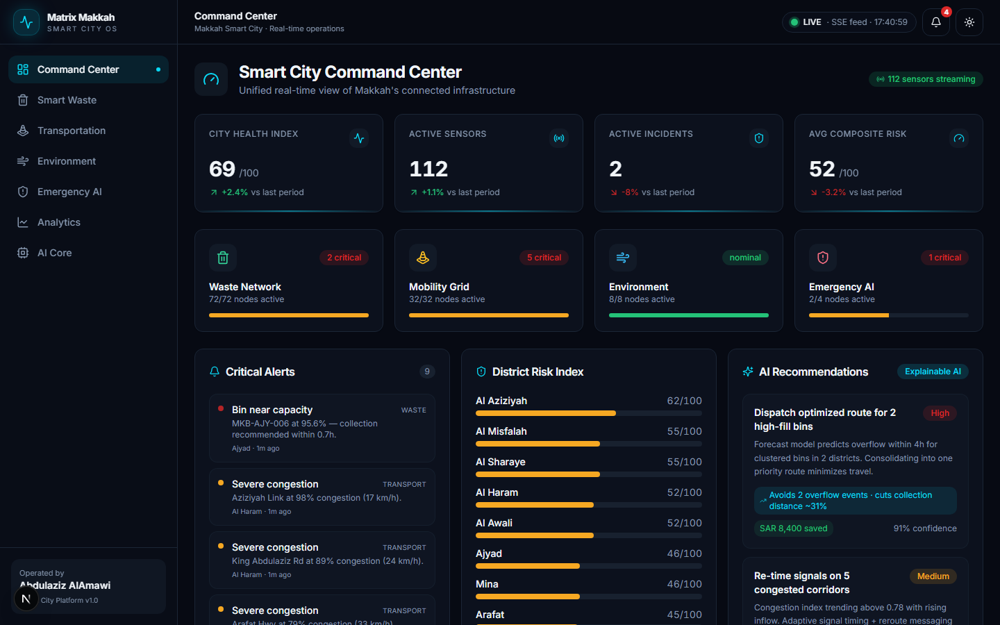
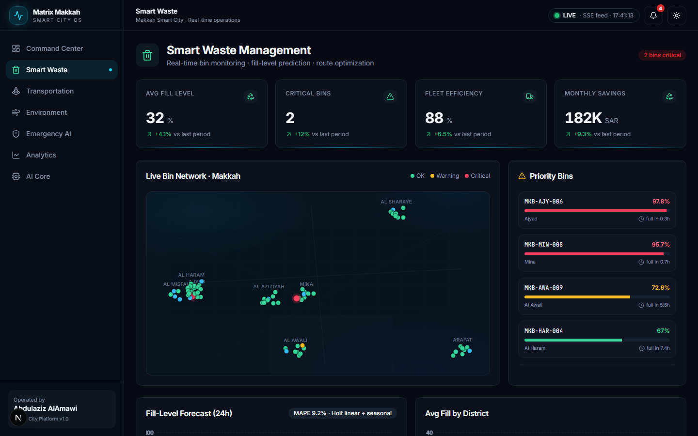
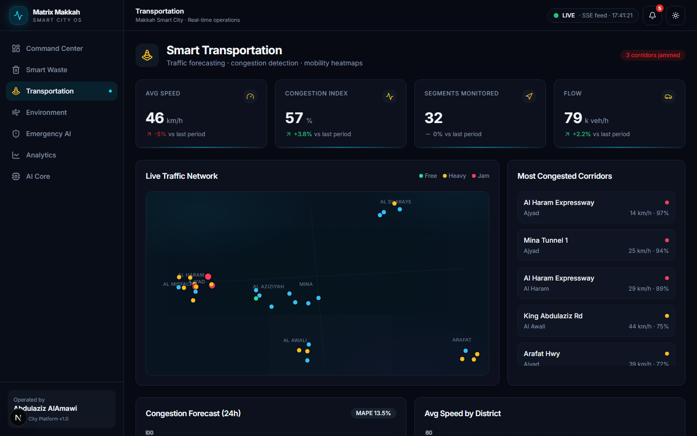
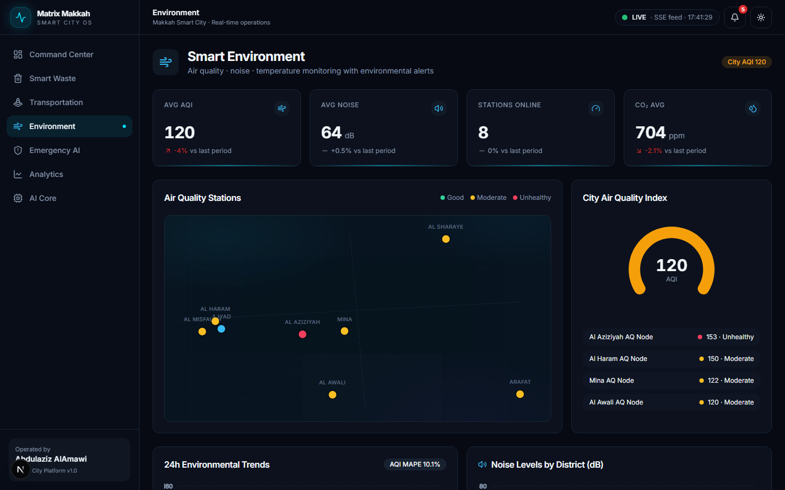
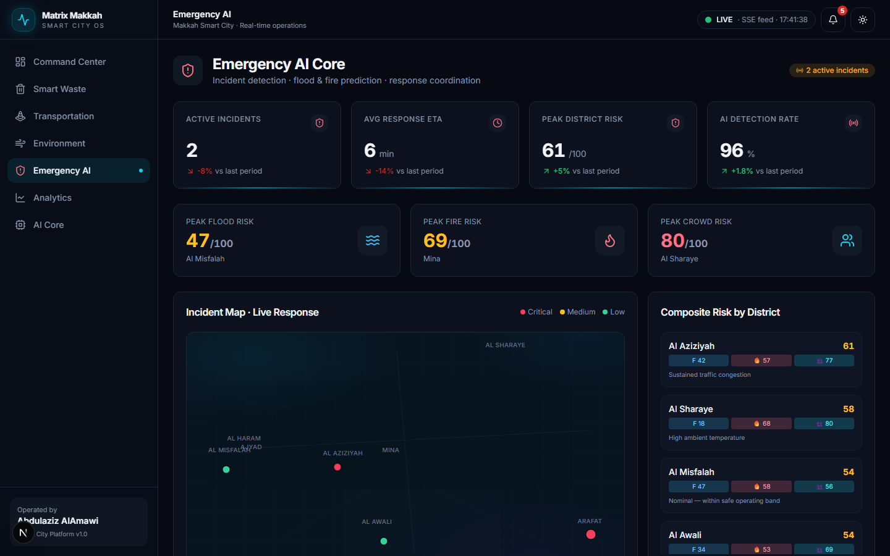
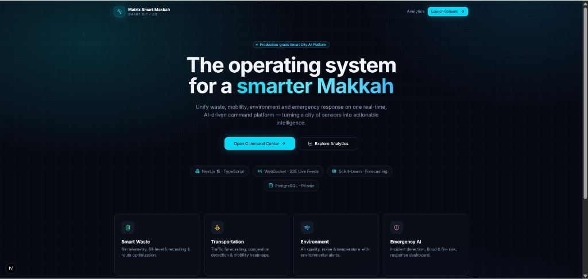

<div align="center">

#  Matrix Smart Makkah

### AI-Powered Smart City Operating System

**Real-time IoT telemetry · Predictive analytics · Emergency AI · Urban intelligence — unified in one command platform.**

<br/>

[](https://github.com/Abdulaziz-Alamawi/matrix-smart-makkah/actions/workflows/ci.yml)
[](https://vercel.com/new/clone?repository-url=https%3A%2F%2Fgithub.com%2FAbdulaziz-Alamawi%2Fmatrix-smart-makkah&project-name=matrix-smart-makkah&root-directory=apps%2Fweb)

<br/>

[](https://nextjs.org/)
[](https://www.typescriptlang.org/)
[](https://fastapi.tiangolo.com/)
[](https://www.python.org/)
[](https://www.postgresql.org/)

[](https://www.docker.com/)
[](#-real-time-monitoring)
[](#-smart-city-vision)
[](#-ai-analytics-center)
[](./LICENSE)

<br/>



</div>

---

## Table of Contents

- [Project Overview](#-project-overview)
- [Smart City Vision](#-smart-city-vision)
- [Key Features](#-key-features)
- [Smart Waste Management](#-smart-waste-management)
- [Smart Transportation](#-smart-transportation)
- [Smart Environment Monitoring](#-smart-environment-monitoring)
- [Emergency AI Core](#-emergency-ai-core)
- [Smart City Command Center](#-smart-city-command-center)
- [AI Analytics Center](#-ai-analytics-center)
- [System Architecture](#-system-architecture)
- [Technology Stack](#-technology-stack)
- [Real-Time Monitoring](#-real-time-monitoring)
- [Live Demo](#-live-demo)
- [Installation](#-installation)
- [Deployment Guide](#-deployment-guide)
- [Folder Structure](#-folder-structure)
- [Screenshots](#-screenshots)
- [Project Statistics](#-project-statistics)
- [Future Improvements](#-future-improvements)
- [Author](#-author)

---

##  Project Overview

**Matrix Smart Makkah** is a production-grade **Smart City Operating System** that ingests
live IoT telemetry from across the city of Makkah, runs predictive AI models, and presents
operators with a premium real-time command center for data-driven decision-making.

The platform unifies four critical urban domains — **waste**, **mobility**, **environment**,
and **emergency response** — into a single coherent product, demonstrating an end-to-end
full-stack and AI engineering capability: modern web architecture, a Python machine-learning
microservice, a relational data model, real-time streaming, and containerized deployment.

> Built for one of the most logistically complex cities on earth — where millions of pilgrims
> create extreme, time-sensitive demands on infrastructure — Matrix Smart Makkah turns a city
> of sensors into actionable intelligence.

---

##  Smart City Vision

Modern cities generate enormous volumes of sensor data, yet most of it is siloed and reactive.
Matrix Smart Makkah is built on three principles:

| Principle | Description |
|-----------|-------------|
| **Real-time first** | Operators see the city *as it is now*, with sub-5-second data freshness. |
| **AI-native** | Forecasting, risk scoring, and recommendations are core to the platform — not bolted on. |
| **Actionable** | Every signal maps to a decision: a route, a dispatch, an advisory, a pre-deployment. |

The system is designed to scale from a demonstration sensor grid to a city-wide deployment by
swapping the synthetic data engine for a real IoT device gateway (MQTT/Kafka) — without
changing the application tier.

---

##  Key Features

-  **Unified Command Center** — single pane of glass for the entire city.
-  **Smart Waste Management** — bin telemetry, fill-level forecasting, route optimization.
-  **Smart Transportation** — traffic forecasting, congestion detection, mobility heatmaps.
-  **Environment Monitoring** — air quality, noise, temperature with environmental alerts.
-  **Emergency AI Core** — incident detection, flood/fire prediction, response coordination.
-  **AI Analytics Center** — historical analytics, forecast dashboards, executive reports.
-  **Explainable AI** — risk scores and recommendations come with human-readable drivers.
-  **Real-time streaming** — live sensor feeds over Server-Sent Events / WebSocket.
-  **Production-ready** — Dockerized services with health checks and CI.

---

##  Smart Waste Management

Real-time monitoring of the city's smart-bin network with predictive collection planning.

- **Live bin monitoring** — fill level, temperature, battery, and connectivity per bin.
- **Fill-level prediction** — forecasts when each bin will reach capacity (hours-until-full).
- **Route optimization** — a nearest-neighbour vehicle-routing solver builds priority sweeps and reports distance saved versus a naive baseline.
- **Cost-reduction analytics** — projected fuel, labor, and CO₂ savings from optimized collection.



---

##  Smart Transportation

City-scale mobility intelligence for proactive traffic management.

- **Traffic forecasting** — 24-hour congestion forecasts with confidence bands.
- **Congestion detection** — per-segment congestion index, speed, and flow with status classification.
- **Mobility heatmaps** — district × hour congestion heatmaps reveal recurring hotspots.
- **Mobility analytics** — average speed, flow (vehicles/hour), and corridor rankings.



---

##  Smart Environment Monitoring

Continuous environmental sensing with automated public-health alerts.

- **Air quality** — AQI, PM2.5, PM10, and CO₂ per monitoring station.
- **Noise monitoring** — decibel levels by district with threshold alerts.
- **Temperature & humidity** — real-time climate tracking.
- **Environmental alerts** — automatic advisories when AQI or noise exceed safe thresholds.



---

##  Emergency AI Core

Predictive emergency intelligence and coordinated response.

- **Incident detection** — fire, flood, medical, accident, structural, and crowd events with AI confidence scores.
- **Flood & fire prediction** — composite risk modeling per district.
- **Risk scoring** — explainable flood / fire / crowd risk with the drivers behind each score.
- **Emergency response dashboard** — live incident queue with status, response units, and ETA.



---

##  Smart City Command Center

The operational heart of the platform — a unified, real-time view of the connected city.

- **City overview** — city health index, active sensors, active incidents, composite risk.
- **Live monitoring** — module health for waste, mobility, environment, and emergency.
- **Critical alerts** — prioritized, severity-ranked alert feed across all domains.
- **AI recommendations** — explainable, prioritized actions with estimated impact and savings.


---

##  AI Analytics Center

Historical analytics and forward-looking intelligence for planners and city leadership.

- **Historical analytics** — multi-day trends across all monitored systems.
- **Forecast dashboards** — waste, traffic, air-quality, and energy forecasts with MAPE accuracy.
- **Trend analysis** — multi-metric correlation views.
- **Heatmaps** — district × weekday activity-load visualizations.
- **Executive reports** — ready-to-export briefs for leadership.

---

##  System Architecture

```
┌────────────────────────────────────────────────────────────┐
│                  Operators / City Leadership                │
└───────────────────────────┬────────────────────────────────┘
                            │  HTTPS / SSE / WebSocket
┌───────────────────────────▼────────────────────────────────┐
│  apps/web  —  Next.js 15 · TypeScript · Tailwind · shadcn   │
│  • App Router dashboards + Framer Motion                    │
│  • REST API routes  (/api/snapshot, /api/forecast, …)       │
│  • Live feed via Server-Sent Events  (/api/stream)          │
└───────────┬───────────────────────────────┬────────────────┘
            │ Prisma                          │ HTTP
┌───────────▼────────────┐      ┌─────────────▼───────────────┐
│  PostgreSQL 16         │      │  services/ml — FastAPI       │
│  (time-series + meta)  │      │  scikit-learn models:        │
│                        │      │  • GradientBoosting forecast │
│                        │      │  • RandomForest risk         │
│                        │      │  • IsolationForest maint.    │
└────────────────────────┘      └──────────────────────────────┘
            ▲
            │  IoT device gateway / stream (synthetic data engine in dev)
┌───────────┴────────────────────────────────────────────────┐
│  Sensors: bins · traffic loops · AQ stations · cameras      │
└─────────────────────────────────────────────────────────────┘
```

📄 Full design details in **[ARCHITECTURE.md](./ARCHITECTURE.md)**.

---

##  Technology Stack

| Layer | Technologies |
|-------|-------------|
| **Frontend** | Next.js 15 (App Router), React 19, TypeScript, TailwindCSS, shadcn-style UI, Framer Motion, Recharts |
| **Backend (API)** | Next.js REST API Routes, Server-Sent Events live feed, Zod validation |
| **AI / ML Service** | Python 3.12, FastAPI, scikit-learn (GradientBoosting, RandomForest, IsolationForest), NumPy, Pandas |
| **Database** | PostgreSQL 16, Prisma ORM (time-series readings + metadata) |
| **Realtime** | Server-Sent Events (Socket.IO / WebSocket-compatible transport layer) |
| **DevOps** | Docker, Docker Compose, multi-stage builds, health checks, GitHub Actions CI |

---

##  Real-Time Monitoring

The platform streams a fresh city snapshot every few seconds, emulating a live IoT gateway.

- **Transport** — Server-Sent Events (`text/event-stream`) for one-way live push, proxy-friendly and reconnect-safe.
- **Resilience** — the client `LiveDataProvider` opens an `EventSource`; if the stream drops, it transparently falls back to interval polling.
- **WebSocket-ready** — the channel is abstracted so a Socket.IO / WebSocket transport can be dropped in without touching UI components.

| Method | Endpoint | Description |
|--------|----------|-------------|
| `GET` | `/api/snapshot` | Full real-time city telemetry snapshot |
| `GET` | `/api/stream` | Live sensor feed (Server-Sent Events) |
| `GET` | `/api/forecast?metric=` | Forecast (proxies the ML service) |
| `GET` | `/api/health` | Liveness probe |
| `POST` | `:8000/forecast` | ML forecast (GradientBoosting) |
| `POST` | `:8000/risk` | Composite risk score (RandomForest) |
| `POST` | `:8000/maintenance` | Predictive maintenance (IsolationForest) |

---

##  Live Demo

The platform runs fully in the browser using a built-in synthetic IoT data engine — no database or sensor grid required.

| Action | Link |
|--------|------|
| **Live site** | [matrix-smart-makkah.vercel.app](https://matrix-smart-makkah.vercel.app) |
| **Deploy instantly** | [](https://vercel.com/new/clone?repository-url=https%3A%2F%2Fgithub.com%2FAbdulaziz-Alamawi%2Fmatrix-smart-makkah&project-name=matrix-smart-makkah&root-directory=apps%2Fweb) |
| **Run locally** | `cd apps/web && npm install && npm run dev` → http://localhost:3000 |
| **Full stack** | `docker compose up --build` |

After deploying, open **Command Center** at `/command-center` to explore live dashboards.

📄 Detailed deployment options in **[docs/DEPLOYMENT.md](./docs/DEPLOYMENT.md)**.

---

##  Installation

### Prerequisites

- Node.js 22+
- Python 3.12+
- (Optional) PostgreSQL 16 and Docker

### Web Application

```bash
cd apps/web
npm install
npm run dev
# → http://localhost:3000
```

### ML Service

```bash
cd services/ml
python -m venv .venv
# Windows: .venv\Scripts\Activate.ps1   |   macOS/Linux: source .venv/bin/activate
pip install -r requirements.txt
uvicorn app.main:app --reload --port 8000
# → http://localhost:8000/docs
```

### Database (optional — enables persistence)

```bash
cd apps/web
cp .env.example .env
npx prisma generate
npx prisma db push
npm run prisma:seed
```

 The web app ships with a deterministic **synthetic IoT data engine**, so every dashboard is
> fully live **without** a database or sensor grid — ideal for demos and evaluation.

---

## Deployment Guide

### One-command full stack (Docker)

```bash
docker compose up --build
# Web      → http://localhost:3000
# ML API   → http://localhost:8000/docs
# Postgres → localhost:5432
```

The compose stack wires **PostgreSQL → ML service → Web** with health-gated startup. The
configuration maps cleanly to Kubernetes (Deployments + Services + readiness/liveness probes)
and any container platform (AWS ECS, Azure Container Apps, Google Cloud Run).

| Service | Image | Port |
|---------|-------|------|
| `web` | Next.js standalone (multi-stage, non-root) | 3000 |
| `ml` | Python slim + FastAPI | 8000 |
| `db` | `postgres:16-alpine` | 5432 |

---

##  Folder Structure

```
matrix-smart-makkah/
├── apps/
│   └── web/                     # Next.js 15 frontend + REST/SSE backend
│       ├── src/app/             # Routes: landing, command-center, modules, analytics, ai
│       ├── src/app/api/         # REST + SSE endpoints
│       ├── src/components/      # UI, charts, dashboard, shell
│       ├── src/lib/             # data-engine, ml, routing, types, districts
│       ├── src/hooks/           # live-data (SSE) provider
│       └── prisma/              # schema.prisma + seed.ts
├── services/
│   └── ml/                      # FastAPI + scikit-learn microservice
│       └── app/                 # main.py, models.py, schemas.py
├── docs/
│   └── screenshots/             # Dashboard screenshots
├── scripts/                     # Automation scripts
├── .github/workflows/           # CI pipeline
├── docker-compose.yml           # db + web + ml orchestration
├── ARCHITECTURE.md
└── README.md
```

---

##  Screenshots

| Command Center | Smart Transportation |
|:---:|:---:|
|  |  |

| Smart Waste Management | Environment Monitoring |
|:---:|:---:|
|  |  |

| Emergency AI Core | Landing Experience |
|:---:|:---:|
|  |  |

---

##  Project Statistics

<div align="center">

| | |
|---|---|
|  **Full-Stack Architecture** | Polyglot Node + Python with a relational data layer |
|  **AI-Powered Smart City Platform** | scikit-learn models across four urban domains |
|  **IoT Integration** | Live multi-sensor telemetry grid (bins, traffic, air, incidents) |
|  **Real-Time Monitoring** | Sub-5s live streaming via SSE / WebSocket |
|  **Predictive Analytics** | District risk scoring + executive analytics |
|  **Forecasting Models** | GradientBoosting time-series forecasting with confidence bands |
|  **Emergency Response Intelligence** | Incident detection, flood/fire risk, dispatch ETA |
|  **Docker Support** | Multi-stage images + Compose orchestration |
|  **Production-Ready Deployment** | Health checks, CI pipeline, cloud-ready config |

</div>

---

##  Future Improvements

-  **Live IoT ingestion** — replace the synthetic engine with an MQTT/Kafka device gateway.
-  **Model registry & retraining** — scheduled retraining with MLflow and drift monitoring.
-  **Geospatial maps** — integrate Mapbox/Leaflet tiles for true geographic visualization.
-  **Auth & RBAC** — operator roles, audit logs, and SSO.
-  **TimescaleDB** — hypertables for high-volume time-series at city scale.
-  **Mobile companion** — field-operator app for dispatch and inspections.
-  **Kubernetes Helm charts** — first-class cloud-native deployment.

See also [CONTRIBUTING.md](./CONTRIBUTING.md) and [SECURITY.md](./SECURITY.md).

---

##  Author

**Abdulaziz AlAmawi**
Full-Stack & AI Engineer — Smart Cities · IoT · Real-Time Systems · Predictive Analytics

This project is owned, designed, and maintained by **Abdulaziz AlAmawi** as a demonstration of
end-to-end engineering across artificial intelligence, smart-city systems, IoT, real-time
architecture, data analytics, and full-stack development.

---

<div align="center">

### Built and Maintained by **Abdulaziz AlAmawi**

MIT Licensed © 2026 Abdulaziz AlAmawi

</div>
